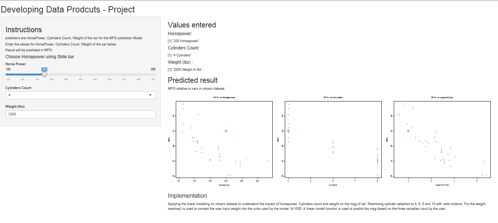

DataProducts-courseProject
========================================================
author: Raghav
date: 22 Oct, 2015
transition: rotate

Problem Statement
========================================================

This R presentation is developed as part of course project using shiny app.


The id designed to predict the MPG against the below variables.


- Horsepower

- Cylinders count

- Weight (in lbs)

DataSet Used
========================================================
mtcars dataset is used for analysing the characteristics of the MPG against Horsepower, # cylinders, weight of the car. A summary of the data set is given below.


```r
data(mtcars);
summary(mtcars)
```

```
      mpg             cyl             disp             hp       
 Min.   :10.40   Min.   :4.000   Min.   : 71.1   Min.   : 52.0  
 1st Qu.:15.43   1st Qu.:4.000   1st Qu.:120.8   1st Qu.: 96.5  
 Median :19.20   Median :6.000   Median :196.3   Median :123.0  
 Mean   :20.09   Mean   :6.188   Mean   :230.7   Mean   :146.7  
 3rd Qu.:22.80   3rd Qu.:8.000   3rd Qu.:326.0   3rd Qu.:180.0  
 Max.   :33.90   Max.   :8.000   Max.   :472.0   Max.   :335.0  
      drat             wt             qsec             vs        
 Min.   :2.760   Min.   :1.513   Min.   :14.50   Min.   :0.0000  
 1st Qu.:3.080   1st Qu.:2.581   1st Qu.:16.89   1st Qu.:0.0000  
 Median :3.695   Median :3.325   Median :17.71   Median :0.0000  
 Mean   :3.597   Mean   :3.217   Mean   :17.85   Mean   :0.4375  
 3rd Qu.:3.920   3rd Qu.:3.610   3rd Qu.:18.90   3rd Qu.:1.0000  
 Max.   :4.930   Max.   :5.424   Max.   :22.90   Max.   :1.0000  
       am              gear            carb      
 Min.   :0.0000   Min.   :3.000   Min.   :1.000  
 1st Qu.:0.0000   1st Qu.:3.000   1st Qu.:2.000  
 Median :0.0000   Median :4.000   Median :2.000  
 Mean   :0.4062   Mean   :3.688   Mean   :2.812  
 3rd Qu.:1.0000   3rd Qu.:4.000   3rd Qu.:4.000  
 Max.   :1.0000   Max.   :5.000   Max.   :8.000  
```

Methodology used for prediction
========================================================
Have applied linear modeling on mtcars dataset with MGS as predictor and horsepower, # cylinders, weight as variables. 
- The range of 'Horsepower' is 200 - 500 Hp, which can be choosen using slide bar
- The # of cyclinders are limited to 4,6,8,10 for analysis, which can be choosen from drop down
- The range of Weight of car is from 2K to 10 K Lbs, which can be choosen usign select box. The weight, reactive() is used to convert the user input weight into the units used by the model, lb/1000. A linear model function is used to predict the mpg based on the three variables input by the user


```
(Intercept)          hp         cyl          wt 
 38.7517874  -0.0180381  -0.9416168  -3.1669731 
```


```r
mpg <- function(hp, cyl, wt) {
  modFit$coefficients[1] + modFit$coefficients[2] * hp + 
    modFit$coefficients[3] * cyl + modFit$coefficients[4] * wt
}
```

Application details
=====================



